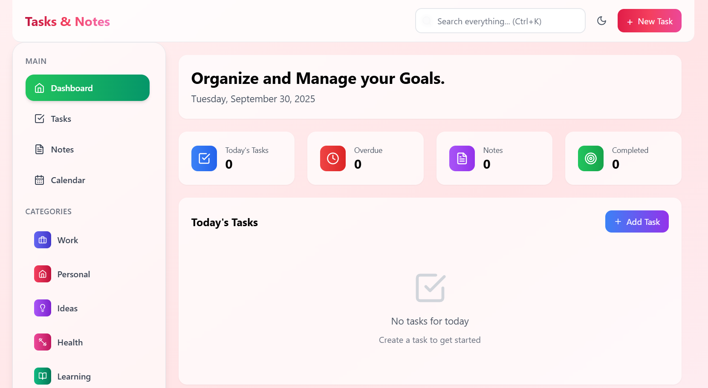
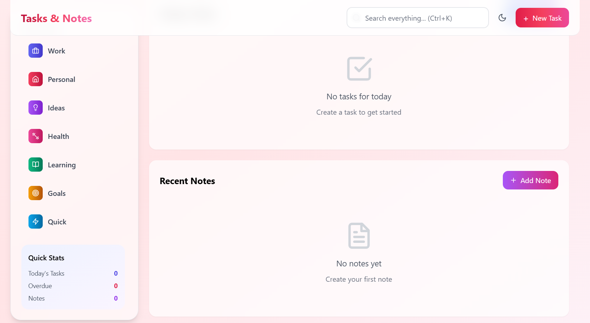

# Tasks & Notes - Modern Task & Note Management

A beautiful, feature-rich task management and note-taking application built with React and Tailwind CSS, featuring a sophisticated wine-themed design system.




## Features

### Task Management
- **Create & Organize Tasks** - Full CRUD operations with categories and priorities
- **Smart Filtering** - Filter by status, priority, due date, category, and starred items
- **Multiple Views** - Switch between grid and list layouts
- **Priority System** - High, Medium, and Low priority with visual indicators
- **Due Date Tracking** - Calendar integration with overdue alerts
- **Progress Tracking** - Visual progress bars and completion statistics
- **Search** - Instant search across all tasks with keyboard shortcuts

### Note Taking
- **Rich Notes** - Create detailed notes with titles and content
- **Color Coding** - 7 color themes for visual organization
- **Categories** - Organize notes by Work, Personal, Ideas, Journal, etc.
- **Starred Items** - Mark important notes for quick access
- **Archive System** - Keep your workspace clean without deleting
- **Full-Text Search** - Search through note titles and content

### User Experience
- **Dark/Light Themes** - Beautiful themes with automatic system detection
- **Keyboard Shortcuts** - Ctrl+K for search, Ctrl+N for new task, ESC to close
- **Responsive Design** - Optimized for desktop, tablet, and mobile
- **Smooth Animations** - Delightful micro-interactions throughout
- **Toast Notifications** - Elegant feedback for all actions
- **Data Persistence** - Auto-save to localStorage with cross-tab sync

### Dashboard
- **Today's Focus** - See your tasks for today at a glance
- **Progress Visualization** - Track completion rates and statistics
- **Quick Stats** - Overview of pending, completed, and overdue items
- **Recent Notes** - Quick access to your latest thoughts
- **Smart Alerts** - Overdue task warnings and upcoming reminders

## Tech Stack

- **React 18** - Modern React with hooks
- **Vite** - Lightning-fast build tool and dev server
- **Tailwind CSS 3** - Utility-first CSS framework
- **Lucide React** - Beautiful icon library
- **Context API** - State management for themes
- **LocalStorage** - Client-side data persistence

## Getting Started

### Prerequisites

- Node.js 16+ and npm/yarn
- Modern web browser

### Installation

1. Clone the repository:
```bash
git clone https://github.com/Sagarika311/taskflow-app.git
cd taskflow-app
```

2. Install dependencies:
```bash
npm install
```

3. Start the development server:
```bash
npm run dev
```

4. Open your browser to `http://localhost:5173`

### Building for Production

```bash
npm run build
```

The production-ready files will be in the `dist` folder.

### Preview Production Build

```bash
npm run preview
```

## Project Structure

```
taskflow-app/
├── public/              # Static assets
├── src/
│   ├── components/      # React components
│   │   ├── Dashboard.jsx
│   │   ├── TasksView.jsx
│   │   ├── NotesView.jsx
│   │   ├── CalendarView.jsx
│   │   ├── Sidebar.jsx
│   │   ├── SearchBar.jsx
│   │   ├── TaskModal.jsx
│   │   ├── NoteModal.jsx
│   │   └── Toast.jsx
│   ├── contexts/        # React contexts
│   │   └── ThemeContext.jsx
│   ├── data/            # Static data
│   │   └── categories.js
│   ├── hooks/           # Custom hooks
│   │   └── useLocalStorage.js
│   ├── utils/           # Utility functions
│   │   ├── colors.js
│   │   └── helpers.js
│   ├── styles/          # CSS files
│   │   └── custom.css
│   ├── App.jsx          # Main app component
│   └── main.jsx         # Entry point
├── index.html
├── package.json
├── tailwind.config.js
├── vite.config.js
└── README.md
```

## Configuration

### Theme Customization

The wine color palette can be customized in `tailwind.config.js`:

```javascript
colors: {
  wine: {
    500: '#ec4899',  // Base wine color
    600: '#db2777',  // Medium wine
    700: '#be185d',  // Darker wine
    // ... more shades
  }
}
```

### Categories

Add or modify categories in `src/data/categories.js`:

```javascript
export const categories = [
  { 
    id: 1, 
    name: 'Work', 
    icon: Briefcase, 
    color: 'from-red-900 to-red-800',
    description: 'Professional tasks'
  },
  // Add more categories...
];
```

## Keyboard Shortcuts

- `Ctrl/Cmd + K` - Focus search bar
- `Ctrl/Cmd + N` - Create new task
- `ESC` - Close modal/dialog
- `Tab` - Navigate between fields
- `Enter` - Submit form

## Contributing

Contributions are welcome! Please follow these steps:

1. Fork the repository
2. Create a feature branch (`git checkout -b feature/AmazingFeature`)
3. Commit your changes (`git commit -m 'Add some AmazingFeature'`)
4. Push to the branch (`git push origin feature/AmazingFeature`)
5. Open a Pull Request

## Troubleshooting

### Tasks not saving
- Check browser's localStorage is enabled
- Clear browser cache and reload
- Check browser console for errors

### Theme not changing
- Clear localStorage: `localStorage.clear()`
- Check system dark mode settings
- Try a hard refresh (Ctrl+Shift+R)

### Performance issues
- Clear old archived tasks
- Limit number of active tasks
- Disable animations in browser settings

## License

This project is licensed under the MIT License - see the [LICENSE](LICENSE) file for details.

## Acknowledgments

- Design inspiration from Todoist, Notion, and Apple Notes
- Icons by [Lucide](https://lucide.dev)
- Wine color palette inspired by modern minimalism
- Built with [Vite](https://vitejs.dev) and [Tailwind CSS](https://tailwindcss.com)

## Contact

- GitHub: [@Sagarika311](https://github.com/Sagarika311)
- Email: sagarikabhagat311@gmail.com
- Portfolio: [sagarika-portfoliowebsite.netlify.app](https://sagarika-portfoliowebsite.netlify.app)

## Support

If you find this project helpful, consider:
- Starring the repository
- Sharing with others
- Contributing code or ideas
- Reporting bugs and issues

---

**Built with ❤️ by Sagarika**

Last updated: 2025
"# Modern-Task-Note-Management-App" 
